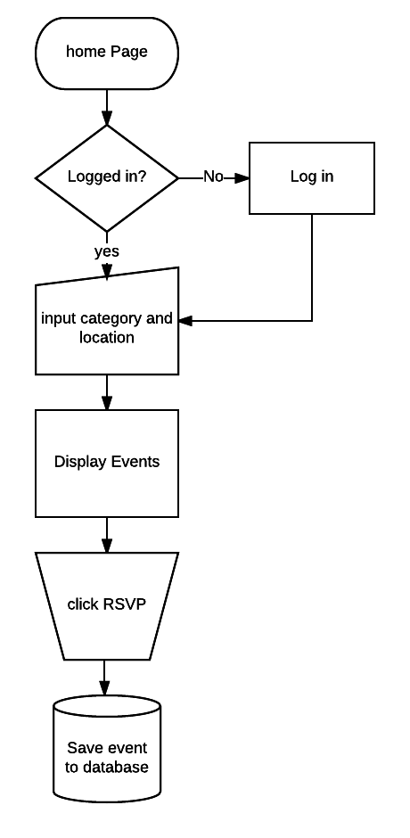
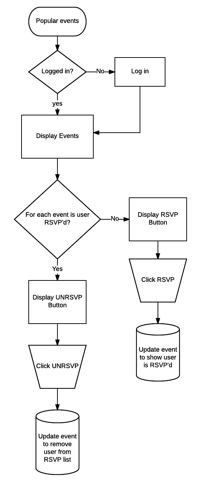

# local-events
----
Uses the eventful api to search for local events by category and location. Rsvp to events and see who else has rsvp'd to events.

## User Stories
* A user can create a new user
* A user can log in and log out
* A user can search for events by location and category.
* A user can RSVP to event
* A user can unRSVP to event
* A user can list events that people have RSVP'd to
* A user can view who else has RSVP'd to events.

## Wireframe

## Flowcharts

### Home Page

### Popular events Page

#Live Version
You can find the live version [here](https://peaceful-biscayne-72459.herokuapp.com)

##Technology:
The backend is built with node.js and express. The front end is using HTML, CSS, and Javascript as well as the ejs library to do front end ejs processing. The event data is taken from the eventful.com API.

##Aproach Taken
This app uses Ajax on the front end to call the backend which calls the eventfull API to search for events. When a user RSVP's to an event from the home page, the event is saved to the database with the user listed as RSVP'd. The popular page lists all the events that people have RSVP't to and let's the current user RSVP or UNRSVP to each event listed.
